## Task Management Bot

**Task Management Bot** — Telegram-бот для управления задачами, реализованный на основе Java Spring с использованием реактивного стека и модульной архитектуры.

Ссылка на Docker Hub репозиторий c Docker-образом:  
[](https://hub.docker.com/r/stanleystanmarsh/task_management_bot)

Ссылка на Telegram-бота:  
[](https://t.me/TaskMana9ementBot)

---

### Технологический стек

* **Язык программирования:** Java 23
* **Spring Framework** (без Spring Boot)
* **Spring WebFlux** - реактивная обработка запросов
* **Spring Modulith** - модульная архитектура приложения
* **MongoDB** - документоориентированная СУБД
* **Конфигурация** — `application.properties` и переменные окружения (секреты не хранятся в репозитории)
* **Docker** + **Docker Compose** - контейнеризация и оркестрация сервисов
* **Telegram Bot API** - взаимодействие с пользователями
* **Undertow** - основной сервер для обработки HTTP запросов

---

### Архитектура

Приложение организовано в виде набора модулей в соответствии с модульной архитектурой Spring Modulith. Каждый модуль соответствует подпакету в `ru.spbstu.hsai` и решает определённую задачу:

* **Telegram** (`telegram`) - запуск бота, приём и обработка входящих обновлений, маршрутизация команд к соответствующим сервисам.
* **Usermanagement** (`usermanagement`) - управление пользователями: хранение профилей, прав и ролей.
* **Authors** (`authors`) - предоставление информации об авторах.
* **Check** (`check`) - эндпоинт для проверки работоспособности сервиса (Health Check).
* **Config** (`config`) - загрузка и управление конфигурацией (MongoDB, безопасность, WebFlux).
* **Infrastructure** (`infrastructure`) - служебные классы для запуска сервера и чтения системных свойств.
* **Notification** (`notification`) - планирование и отправка уведомлений о задачах.
* **Simpletaskmanagment** (`simpletaskmanagment`) - CRUD-операции для простых задач.
* **Repeatingtaskmanagment** (`repeatingtaskmanagment`) - CRUD-операции для повторяющихся задач.

Взаимосвязи между модулями:

* Модуль **Notification** использует **Repeatingtaskmanagment**, **Simpletaskmanagment**, **Usermanagement** и **Telegram** для формирования и отправки уведомлений.
* Модуль **Config** зависит от **Infrastructure**, **Check**, **Authors** и **Telegram** и использует **Usermanagement** для управления доступом к конфигурации.
* Модуль **Telegram** взаимодействует с **Authors**, **Usermanagement**, **Simpletaskmanagment** и **Repeatingtaskmanagment**, передавая команды пользователей в соответствующие сервисы.

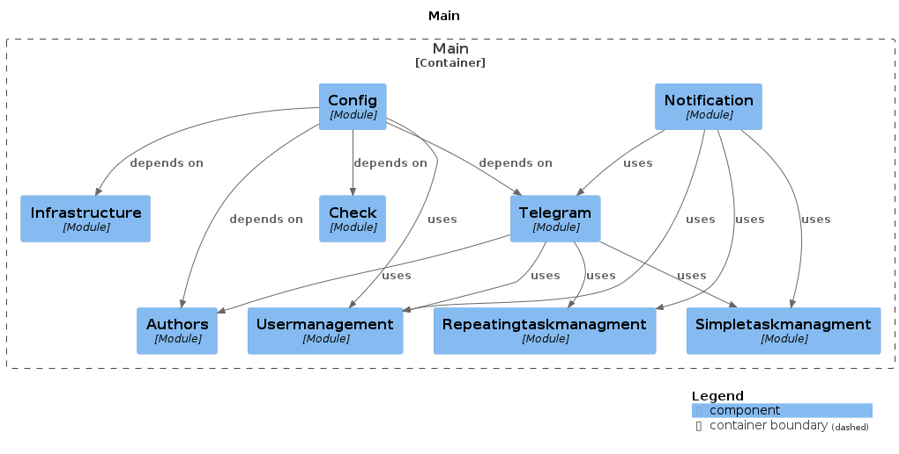

[**Документация Spring Modulith о взаимосвязях между модулями**](https://stanleystanmarsh.github.io/task-manager-bot/).

---

### Сервисы Docker

- **mongo** — MongoDB для приложения.
- **app** — Java-приложение (собирается из [Dockerfile](Dockerfile)), стартует после готовности `mongo`. Секреты и настройки передаются переменными окружения.

**Том** `mongodb_data` сохраняет данные MongoDB между перезапусками.

---

### Конфигурация

Значения по умолчанию задаются в [application.properties](src/main/resources/application.properties); для секретов и переопределения используйте **переменные окружения** (локально или в `docker-compose.yml`). Пример имен: `MONGO_HOST`, `MONGO_PORT`, `MONGO_DATABASE`, `MONGO_USERNAME`, `MONGO_PASSWORD`, `TELEGRAM_BOT_TOKEN`, `TELEGRAM_BOT_USERNAME`, `SUPERADMIN_*`.

Для Docker Compose удобно скопировать [.env.example](.env.example) в `.env` и заполнить значения — `docker compose` подхватит файл `.env` автоматически.

Учётные данные Mongo в [docker-compose.yml](docker-compose.yml) (`MONGO_INITDB_*` и переменные `app` для подключения) должны быть **согласованы**.

---

### Развёртывание

1. Соберите JAR: `mvn package` (артефакт попадёт в `target/`).
2. Создайте `.env` из `.env.example`, укажите токен бота и данные super-admin.
3. Запуск:

```shell
docker compose up --build
```

Сначала поднимется `mongo`, затем после healthcheck — `app`.

---

### Использование

#### HTTP эндпоинты

| Метод     | Путь                          | Описание                                                                                                                                                                | Права доступа                    |
|-----------|-------------------------------|-------------------------------------------------------------------------------------------------------------------------------------------------------------------------|----------------------------------|
| **GET**   | `/hello`                      | Базовый «приветственный» эндпоинт. Возвращает простое текстовое сообщение («Hello, World!») для проверки доступности сервиса.                                           | Любой (permitAll)                |
| **GET**   | `/healthcheck`                | Эндпоинт для проверки «здоровья» сервиса. Возвращает информацию о состоянии приложения (проверка доступности БД).                                                       | Любой (permitAll)                |
| **PATCH** | `/users/{telegramId}/promote` | Повысить роль пользователя с указанным `telegramId`. Присваивает роль `ADMIN`. Также передается новый пароль в теле запроса в формате JSON ({"password":"password123"}) | Только `ADMIN` или `SUPER-ADMIN` |
| **PATCH** | `/self_demote`                | Пользователь, уже обладающий ролью `ADMIN`, может понизить сам себя до обычного пользователя.                                                                           | Только `ADMIN` или `SUPER-ADMIN` |
| **PATCH** | `/users/{telegramId}/demote`  | Понизить роль пользователя с указанным `telegramId`. Удаляет роль `ADMIN`.                                                                                              | Только `SUPER_ADMIN`             |
| **GET**   | `/authors`                    | Возвращает список и информацию об авторах и администраторах бота.                                                                                                       | Любой (permitAll)                |
| **GET**   | `/users`                      | Возвращает список всех зарегистрированных пользователей (кроме данных `SUPER-ADMIN`).                                                                                   | Только `ADMIN` или `SUPER-ADMIN` |


#### Telegram команды

##### Управление задачами

| Команда             | Описание                                                                                                                          |
|---------------------|-----------------------------------------------------------------------------------------------------------------------------------|
| `/newtask`          | Создание новой одноразовой задачи. Пользователь последовательно вводит необходимые параметры (описание, дату, сложность и т. д.). |
| `/updatetask <ID>`  | Редактирование ранее созданной задачи по её уникальному идентификатору. Позволяет изменить параметры задачи.                      |
| `/deletetask <ID>`  | Удаление задачи по указанному идентификатору.                                                                                     |
| `/newrepeatingtask` | Создание повторяющейся задачи (ежечасной, ежедневной, еженедельной) с времени и других параметров.                                |

##### Просмотр задач

| Команда              | Описание                                                             |
|----------------------|----------------------------------------------------------------------|
| `/mytasks`           | Отображение списка всех активных (незавершённых) задач пользователя. |
| `/today`             | Список задач, запланированных на текущую дату.                       |
| `/week`              | Задачи, запланированные на текущую календарную неделю.               |
| `/date <дд.мм.гггг>` | Задачи на конкретную дату, введённую в формате `дд.мм.гггг`.         |
| `/completed`         | Просмотр завершённых задач пользователя.                             |

##### Служебные и информационные команды

| Команда    | Описание                                                        |
|------------|-----------------------------------------------------------------|
| `/start`   | Регистрация нового пользователя и присвоение часового пояса     |
| `/status`  | Отображение текущего состояния бота и его ключевых компонентов. |
| `/authors` | Информация об авторах и администраторах проекта.                |
| `/help`    | Вывод справочного сообщения со списком команд                   |

---
### Демонстрация работы бота
 
Ниже представлены screenshots переписки с ботом, иллюстрирующее команды бота.

|                                     | |
|-------------------------------------|-------------------------|
| Команда /start                      | Команда /help|
| 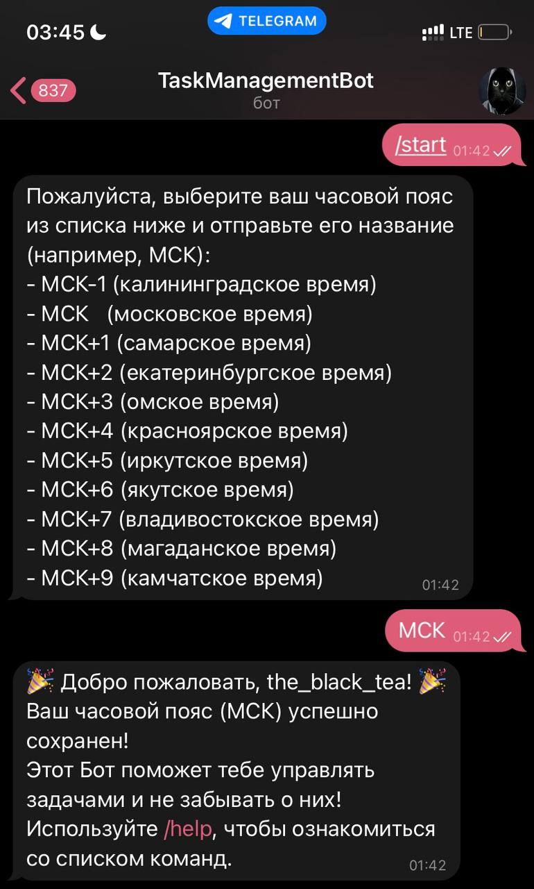 |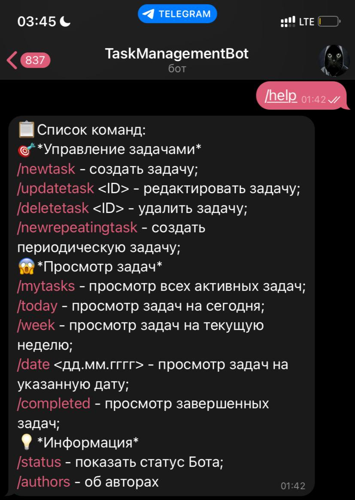  | 
| Команда /newtask                    |      Команда /updatetask                   |
| 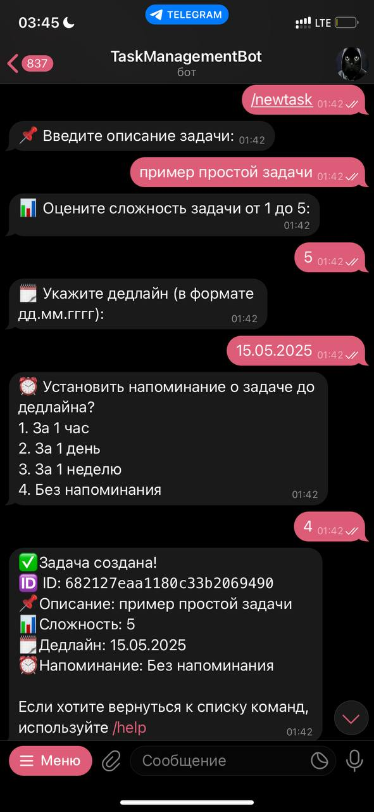       |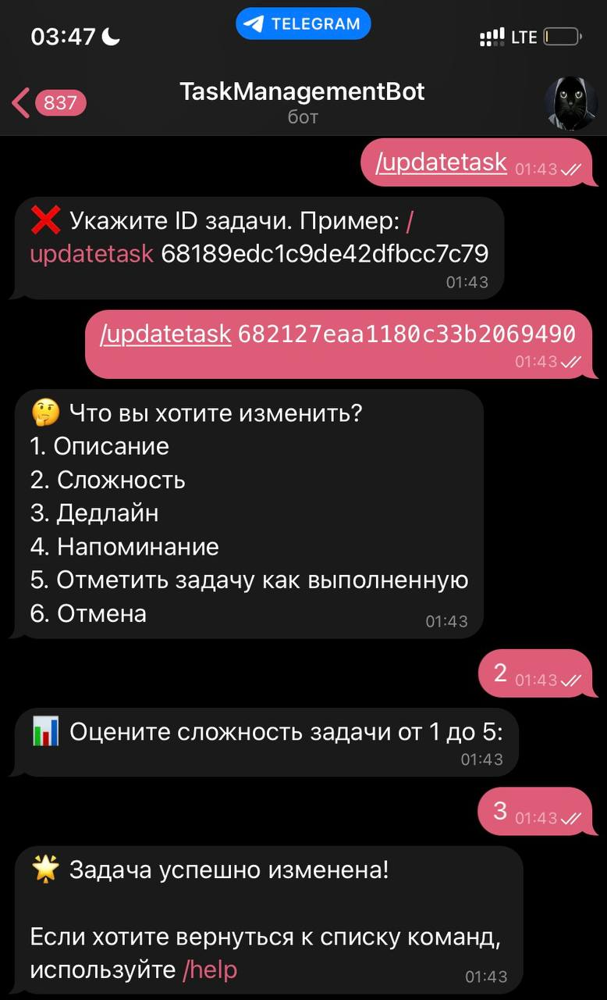|
| Команда /deletetask                 |     Команда /completed                    |
| 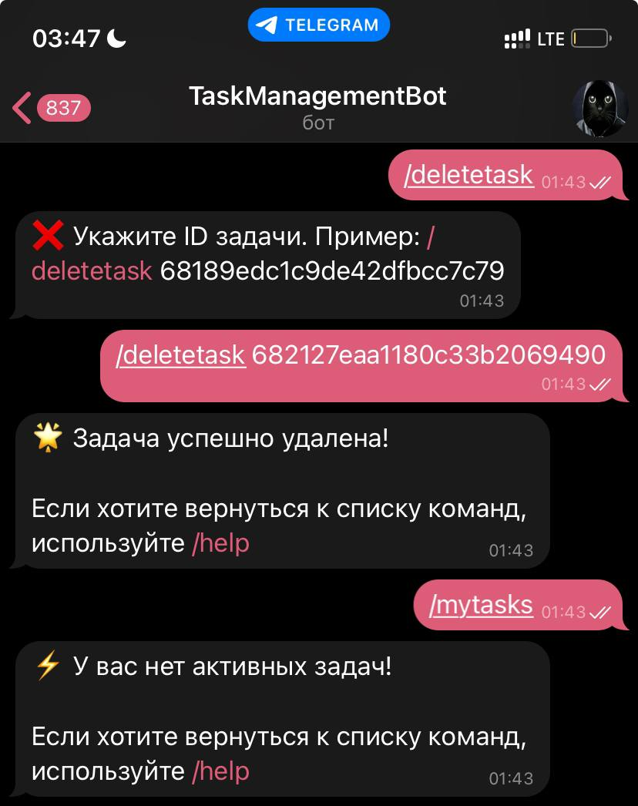         |     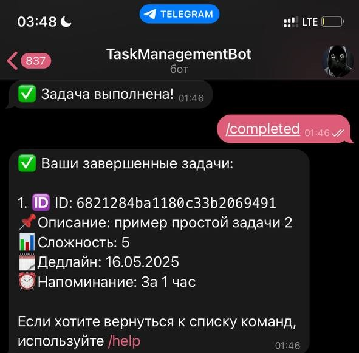                  |
| Команда /authors                    | Команда /status  |
| 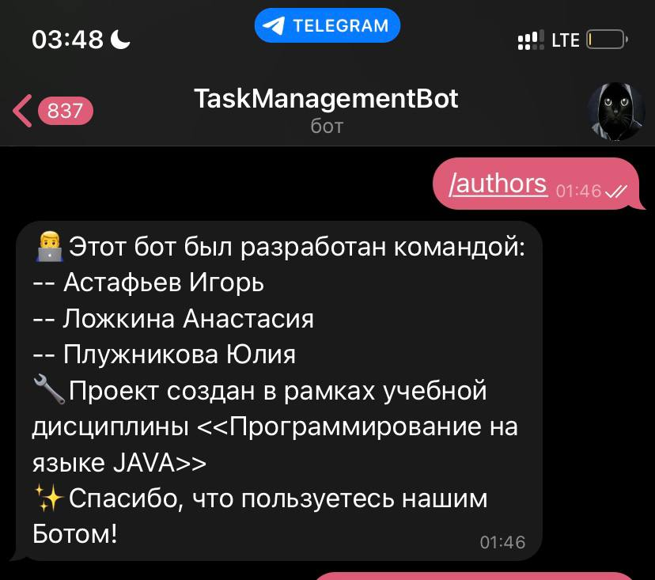           |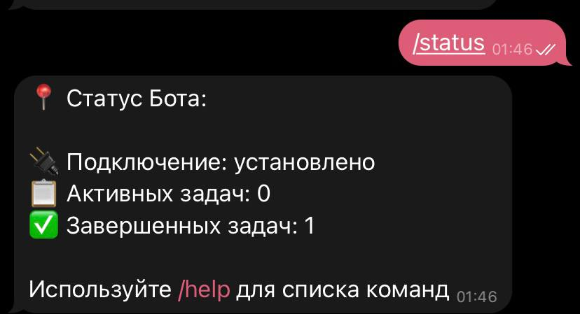|
| Напоминание об одноразовой задаче   | Напоминание о просроченном дедлайне      |
| 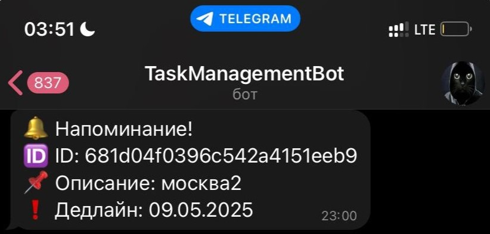      | 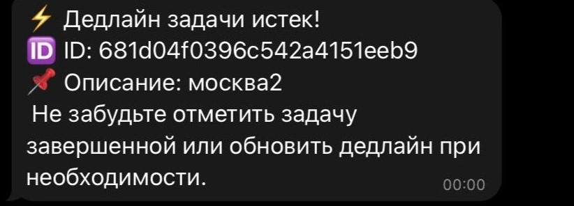   |   
| Команды /week, /today               | |
| 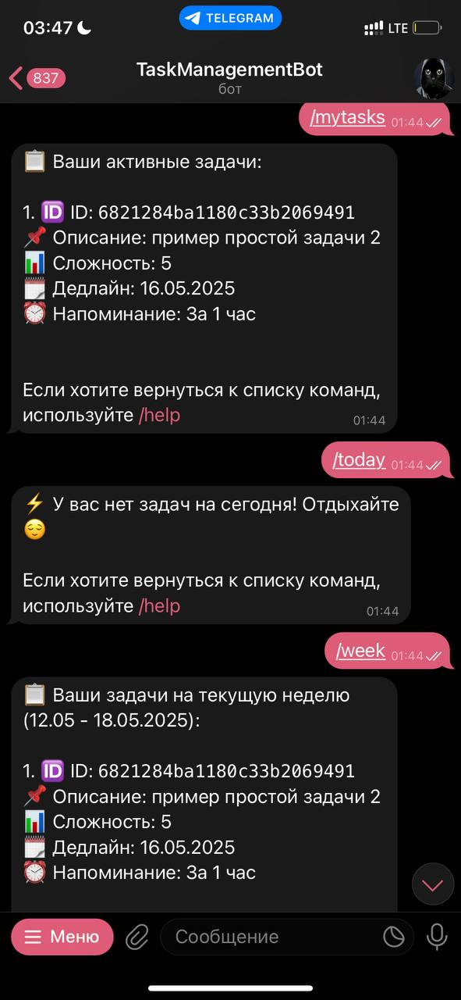           | |
---

### Безопасность

* Секреты не коммитьте в репозиторий: используйте `.env` (в `.gitignore`) или переменные окружения на сервере/в CI.
* Сервисы изолированы в отдельных Docker-контейнерах.

---

### Лицензия

Проект распространяется под лицензией MIT. Подробнее см. файл [LICENSE](LICENSE).

---

### Авторы
* Астафьев Игорь
* Ложкина Анастасия
* Плужникова Юлия

---

